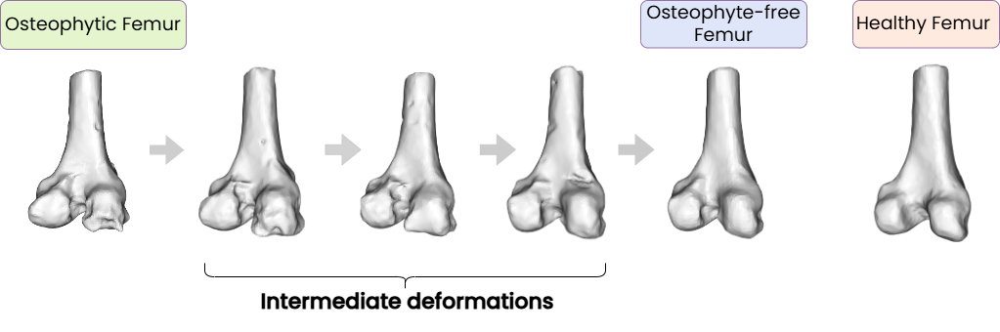
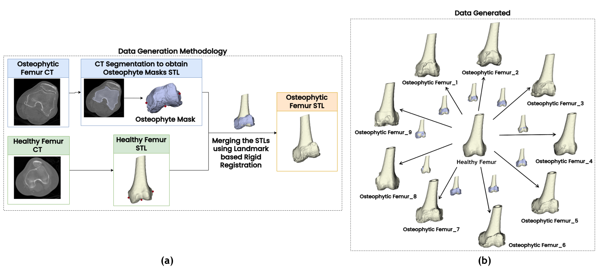
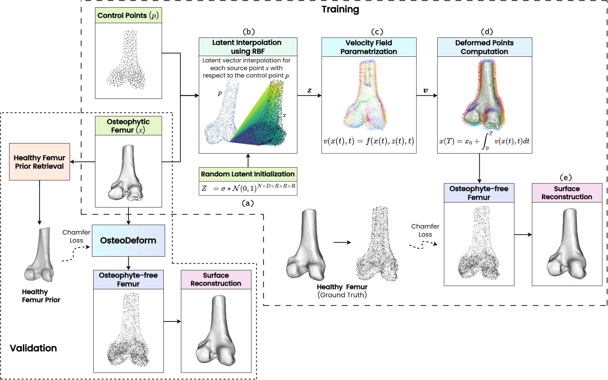
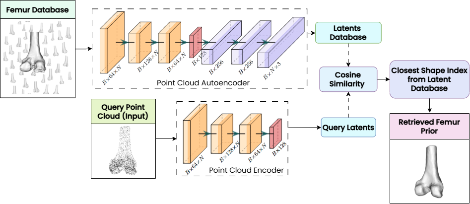

<h1 align="center">OsteoDeform: Osteophyte-Aware Shape Deformations of Distal Femur Models for Surgical Planning in Total Knee Arthroplasty
</h1>

<p  align="center">  
  
`Abstract`. Image-guided robotic Total Knee Arthroplasty (TKA) using Computed Tomography (CT) scans with the assistance of 3D femur models, has been proven to improve surgical outcomes as compared to traditional TKA procedures. The occurrence of osteophytes or bone spurs at the knee joint is attributed mainly to bone loss and ligament instability. This significantly alters the anatomy, making surgical planning
inaccurate.
`Problem Statement`: Given an osteophytic 3D distal femur model, removal of osteophytes during surgical planning facilitates accurate knee segmentation and precise kinematic computation, thus improving TKA
outcomes. 
`Method`: We propose OsteoDeform, a geometric learning framework specifically to remove osteophytes from 3D femur models. We generate the [OSTFemur-Dataset](https://zenodo.org/records/15718534) containing paired osteophytic and healthy distal
femur models on which OsteoDeform is trained.
`Results`: OsteoDeform effectively removes over 70.7% of the distal femoral osteophytes while achieving an average morphometric error of only 0.022±0.05 mm, thereby preserving the anatomical integrity of the distal femur
</p>

<h3 > <i>Index Terms</i> </h3> 

  :diamond_shape_with_a_dot_inside: Total Knee Arthroplasty (TKA)
  :diamond_shape_with_a_dot_inside: Computed Tomography (CT)
  :diamond_shape_with_a_dot_inside: Osteophyte removal
  :diamond_shape_with_a_dot_inside: Surgical Planning
  :diamond_shape_with_a_dot_inside: Shape-based Deformations 
  :diamond_shape_with_a_dot_inside: Geometric Learning
  :diamond_shape_with_a_dot_inside: Femoral morphometric analysis
  

</div>


## <div align="center">Background</div>

<details>
  <summary><i>Osteophyte Removal</i></summary>

  - Osteophyte removal is a standard procedure performed routinely during the surgery to restore soft-tissue balance and improve knee biomechanics. Failure to remove osteophytes can result in unequal flexion along the medial-lateral axis and extension gaps, affecting the alignment and functionality of soft tissues in the region. 
</details>

<details open>
<summary><i>Data Generation</i></summary>
  
  - OSTFemur-Dataset which is a repository of 3D models consisting of 3D osteophytic femurs and their corresponding healthy femurs

</details>

<details open>
<summary><i>OsteoDeform</i></summary>
  
  -  OsteoDeform is a neural deformation-based framework for osteophyte removal. OsteoDeform employs Neural Flow Deformers (NFD) to generate smooth transformations, deforming osteophytic femoral shapes toward pre-diseased anatomical states.

<p align="center">
  
</p>
<div align = "center">
  
  :small_orange_diamond: Osteophyte removal in various intermediate stages 
</div>

</details>
<h2 align="center">Data Generation</h2>
<details>
You can download the dataset from the following link:

🔗 [OSTFemur-Dataset](https://zenodo.org/records/15718534)

The OSTFemur-dataset has 495 osteophytic femur models as PLY meshes with their corresponding healthy femurs.  
55 healthy femurs have 9 osteophytic femur variations each; every healthy femur model has three Grade 4 (Severe), four Grade 3 (moderate) and two Grade 2 (mild) osteophytic femur models.

  - The OSTFemur-dataset is split into train, validation and test data in the 80:10:10 split: 
    train - Train data (395 models)
    val - Validation data (50 models)
    test - Test data (50 models)

Sub-directory-based arrangement:
```
train/
├── normal/
│   ├── femur_001.ply
│   ├── femur_002.ply
│   ├── femur_003.ply
│   └── ...
├── deformed/
│   ├── femur_001/
│   │   ├── femur_001_01.ply
│   │   ├── femur_001_02.ply
│   │   ├── ...
│   │   └── femur_001_09.ply
│   ├── femur_002/
│   └── ...
val/
├── normal/..
├── deformed/..
test/
├── normal/..
├── deformed/..
```

</details>


<p align="center">
  
</p>
<div align = "center">
  
  :small_orange_diamond: 3D Osteophytic Femur Dataset Generation: (a) Data generation pipeline from CT segmentation, (b) 9 different variations of osteophytic femur models generated from a single healthy femur
</div>

## <div align="center">Methodology</div>
<p align="center">
  
</p>
<div align = "center">
  
  :small_orange_diamond: OsteoDeform Pipeline Overview: (a) Random latent initialization with shape [N, D, R, R, R], (b) RBF interpolation of latent features to the osteophytic femur point cloud, (c) Neural parameterization of velocity field f(x(t), z(t), t), (d) Integration over time to compute deformation, (e) Chamfer loss against healthy femur retrieved via prior retrieval, (f) Output osteophyte-free femur point cloud with reconstructed surface.

</div>

<p align="center">
  
</p>
<div align = "center">
  
  :small_orange_diamond: HFPR for fine tuning the OsteoDeform during evaluation: Given an osteophytic
osteophytic femur, the most similar sample from the database is identified using latent
space cosine similarity and its corresponding healthy counterpart is retrieved as the
femur prior.
</div>

## <div align="center">Pre-requisites</div>


To run the **OsteoDeform** project, please ensure your environment meets the following requirements:

### ✅ System Requirements
- OS: **Linux (Ubuntu recommended)**
- GPU: **NVIDIA RTX 4090** or equivalent
- CUDA: **Version 12.2**
- Python: **Recommended 3.10+**
- PyTorch: **2.4.1 with CUDA 12.2**
- Visual Studio: **2019**

### ✅ Virtual Environment Setup (Recommended)
We recommend creating a virtual environment to manage dependencies:

```bash
python3 -m venv osteodeform-env
source osteodeform-env/bin/activate
pip install --upgrade pip
```

### ✅ Required Python Packages

Install the following packages via `pip` these packages are provided in the requirements.txt:

```bash
pip install iopath==0.1.10
pip install ipykernel==6.29.5 ipython==8.31.0 ipywidgets==8.1.5
pip install matplotlib==3.10.0 matplotlib-inline==0.1.7
pip install networkx==3.2.1 numpy==1.26.3
pip install open3d==0.18.0 pandas==2.2.3
pip install parso==0.8.4 pillow==10.2.0
pip install pip==24.3.1 plotly==5.24.1
pip install torch==2.4.1+cu121 torchaudio==2.4.1+cu121 torchvision==0.19.1+cu121
pip install torchdiffeq==0.2.5 tqdm==4.67.1 trimesh==4.5.3
pip install visdom==0.2.4 vtk==9.4.0
pip install point-cloud-utils
```

### ✅ PyTorch3D Installation

PyTorch3D is required and must be installed from source to match CUDA 12.2 and Torch 2.4.1:

```bash
pip install "git+https://github.com/facebookresearch/pytorch3d.git"
```

> **Note:** Ensure `torch`, `torchvision`, and `torchaudio` are installed *before* installing PyTorch3D.

---

###  Femur Morphometric Analysis (Optional)

For clinical shape analysis and morphometry, install **SlicerMorph**:

- Visit the official website: [SlicerMorph Download](https://www.slicermorph.org/download.html)
- Follow the platform-specific installation instructions provided there.

  
## <div align="center">Installation</div>

:arrow_right: Clone the Repository  
```bash
git clone https://github.com/YourUsername/OsteoDeform.git
```

:arrow_right: Navigate to the Project Directory  
```bash
cd OsteoDeform
```

:arrow_right: Create and Activate a Virtual Environment  
```bash
python3 -m venv osteodeform-env
source osteodeform-env/bin/activate
```

:arrow_right: Upgrade pip  
```bash
pip install --upgrade pip
```
## <div align="center">Usage</div>

###  Train the Model

Start Visdom for visualization:
```bash
python -m visdom.server
```

Then run training:
```bash
./train.sh
```

To resume from a checkpoint:
```bash
./train.sh --resume path/to/checkpoint.pth
```

---

###  Evaluate the Model

Run evaluation with a trained checkpoint:
```bash
./test.sh --resume path/to/checkpoint.pth
```


